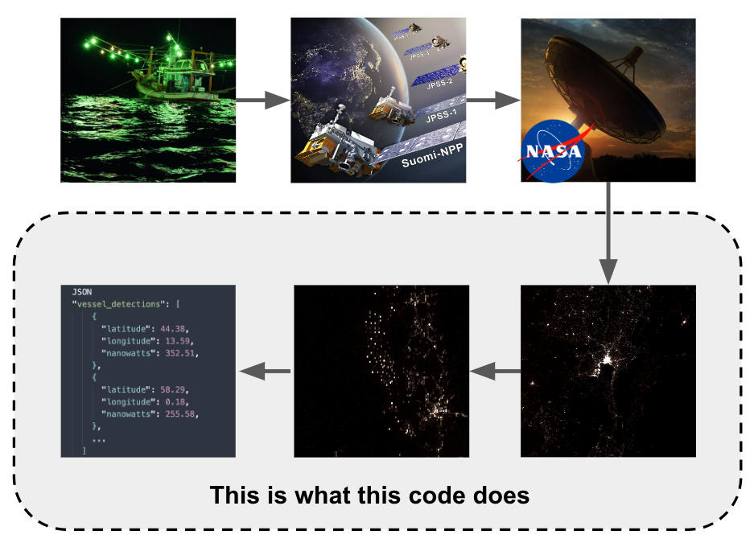
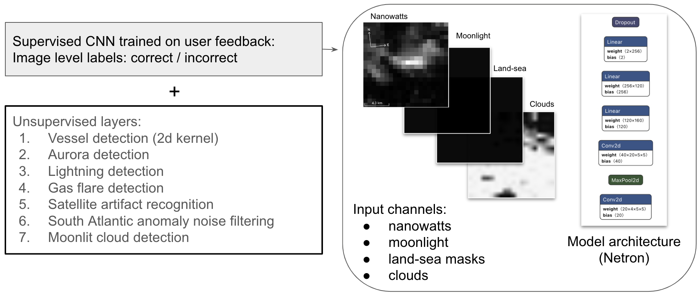

This repository contains a computer vision model along with a containerized API for serving streaming detections of vessels in near real time. See [docs/model_card.md](./docs/model_card.md) for information about the model and [docs/openapi.json](./docs/openapi.json) for the API specification. This model was built for Skylight: a platform that supports maritime transparency through actionable intelligence in order to help protect the planet's oceans.

<p float="left">
  
</p>

---

# Getting started

Note that the model and API are designed to run in resource constrained environments. The hardware requirements are a CPU and at least 4 GB of RAM. Note that a GPU is not needed including for fast inference.

## Prerequisites

- Python 3.10
- Docker: https://docs.docker.com/get-docker/
- Docker Compose: https://docs.docker.com/compose/install/ (note that Docker compose may already be installed depending on how you installed docker)
- git-lfs: https://git-lfs.com/ Test files used for development are stored on GitHub with git-lfs.

## Installation

Use the existing package available from GitHub

```bash
docker pull ghcr.io/vulcanskylight/skylight-vvd:latest
```

```bash
docker run -d -p 5555:5555 vvd-service
```

Or clone this repository and build the container with

```bash
docker compose up
```

The service will now be running on port 5555 (verify with `docker ps -a`).
To query the API with an example request, install `requirements/requirements-inference.txt` on the host.

```bash
python3 -m venv .venv
source .venv/bin/activate
pip install -r requirements/requirements-inference.txt
```

## Usage

```bash
$ python examples/sample_request.py
```

## Tests

Unit and integration tests (see tests/) are run as part of CICD via GitHub actions. To manually run these tests, execute:

```bash
$ pytest tests -vv
```

Test files are stored on GitHub (test/test_files/) using git-lfs (retrieve these files via `git lfs fetch`). Since these are large files they are excluded from the inference docker container.

## Development notes

There are many parameters that can be modified to control precision and recall and tune the model to other desired use cases. See src/config/config.yml for the parameters that can be modified and how to do so.

### Precommit hooks

Hooks can be installed from .pre-commit-config.yaml. For example:

1.  `$ pip install pre-commit`
2.  `$ precommit install`

### Performance

- Real-time latency is measured from the time that the light is emmitted by a vessel and when we ultimately show the deteceted vessel to our users. In our plaftorm, we obvserve an average latency of 2 hours from a ship emitting light to when we surface that data to our users. The latency is determined primarily by the time required to downlink the data to NASA's servers. Our processing time is < 1 second.

## Model architecture

<p float="left">
  
</p>

For details see docs/model_card.md

## Acknowledgements

We are very grateful to NASA for making the raw satellite data freely accessible from earthdata: https://www.earthdata.nasa.gov/. Thanks to NOAA and NASA for launching the satellites. Thanks to https://sips.ssec.wisc.edu/#/ for creating cloud masks. Thanks to the Earth Observation Group at the Colorado School of Mines for extensive research on VIIRS and their work on vessel detection (https://www.mdpi.com/2072-4292/7/3/3020).

## Contributing

If you identify a bug or have a feature request please open an issue. If you discover a new method or an improvement on the models, please fork the repo and create a pull request. You can also simply open an issue with the tag "enhancement" if you discover an issue but don't have a solution.

We are grateful for your feedback and contributions are appreciated.

## Limitations

While we do our best to ensure high precision and recall across the planet every night, the model does not get everything right. The largest source of error occurs around full moons due to the interaction of moonlight and clouds. We control for that source of error by measuring the background glow of clouds and only surfacing detections that are not underneath clouds and above the background glow of clouds. This conditional processing only occurs on and around full moons (+/- 2 days).

Note that the repository only contains the model and service to create streaming vessel detections from raw VIIRS data. There are tools within this repository to download the raw data from NASA's servers but this application does not do so automatically. TO create a fully automated streaming service of vessel detections, one would need to add logic to poll NASA's servers, copy new data, and inference that data (using this service).

## License

Apache 2.0.

## Contact

support@skylight.org
