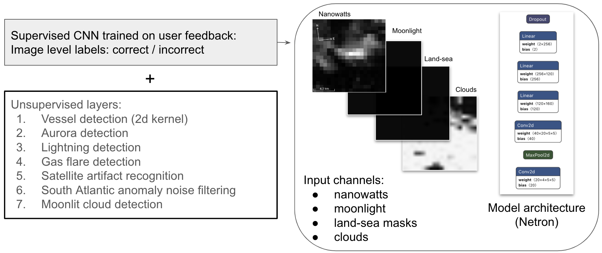

# Skylight Vessel Detection Service

A computer vision model and containerized API for real-time vessel detection from satellite imagery. Built for Skylight's maritime transparency platform to help protect our oceans through actionable intelligence.

- [API Specification](./docs/openapi.json)
- [Paper (arXiv)](https://arxiv.org/abs/2312.03207)


## Requirements

- CPU with 2GB+ RAM (GPU not required)
- Python 3.12
- Docker & Docker Compose
- git-lfs (for test files)

## Quick Start

### Using Pre-built Image

```bash
# Pull and run the container
docker pull ghcr.io/vulcanskylight/skylight-vvd:latest
docker run -d -p 5555:5555 vvd-service
```

### Building Locally

```bash
# Clone and build
git clone https://github.com/vulcanskylight/skylight-vvd.git
cd skylight-vvd
docker compose up
```

### Running Example Inference

```bash
# Set up Python environment
python3 -m venv .venv
source .venv/bin/activate
pip install -r requirements/requirements-inference.txt

# Run sample inference
python examples/sample_request.py
```

## Development

### Testing
```bash
pytest tests -vv
```

### Pre-commit Hooks
```bash
pip install pre-commit
pre-commit install
```

### Configuration
Model parameters can be tuned in `src/config/config.yml`

## Performance

- Average latency: 2 hours (primarily satellite downlink time)
- Processing time: <1 second per image
- No GPU required for fast inference

## Architecture



## Limitations

- Reduced accuracy during full moons (±2 days) due to moonlight-cloud interactions
- Requires external system to poll NASA servers for new data
- Service processes data but does not automatically fetch it

## Contributing

1. Open issues for bugs or feature requests
2. Fork the repo for pull requests
3. See [CONTRIBUTING.md](./CONTRIBUTING.md) for guidelines

## License

Apache 2.0

## Contact

support@skylight.org

## Acknowledgements

- NASA (Earthdata)
- NOAA (Satellites: Suomi-NPP, NOAA-20, NOAA-21)
- Defense Innovation Unit
- SSEC (VIIRS Level 2 products)
- Earth Observation Group
